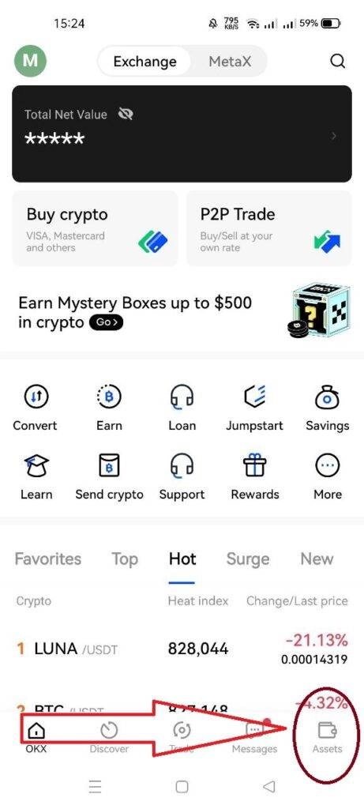
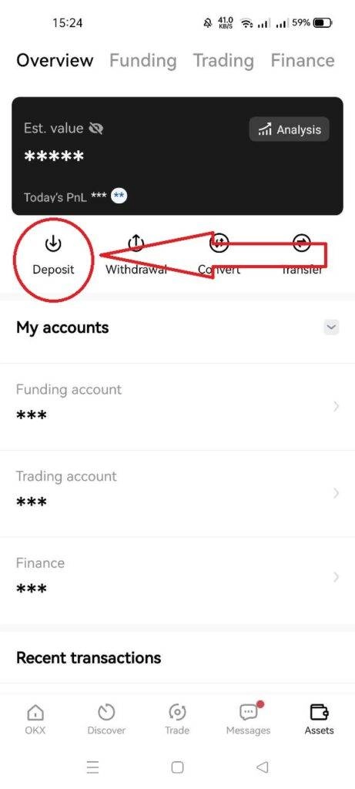
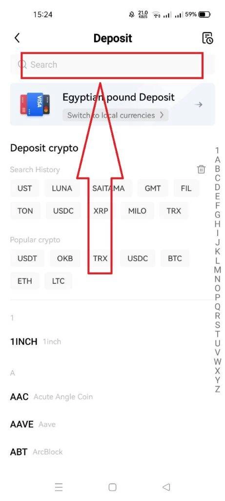
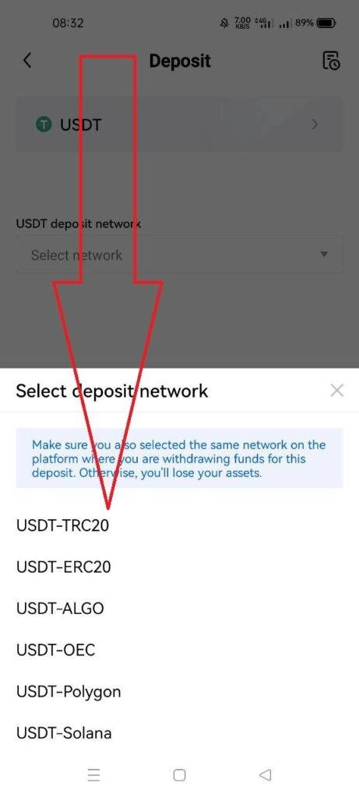
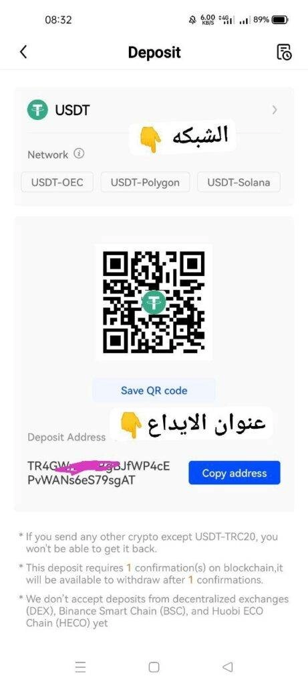
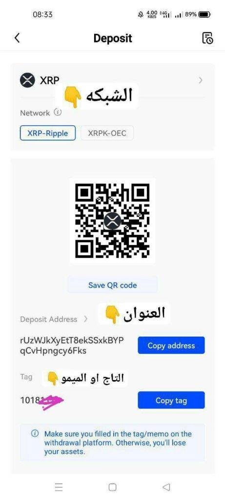

# How to Deposit on OKX After the Latest Platform Updates

---

Depositing crypto on exchanges can feel tricky after interface updates, especially when you're worried about losing funds to a wrong address or missing memo. This guide walks you through OKX's current deposit process step-by-step, covering everything from basic deposits to handling special requirements like memo tags—so you can move your assets confidently without the usual headaches.

---

## What Does "Deposit" Actually Mean?

A deposit is simply receiving cryptocurrency from another platform or wallet into your OKX account. Think of it like giving someone your home address so they can mail you a package—except here, you're sharing a unique crypto address so funds can arrive safely in your account.

The whole thing works through a specific address assigned to you. Here's how to get it done.

## Step-by-Step: Making Your First Deposit

**Step 1:** Log into the OKX platform or open the mobile app. Tap "Assets" at the bottom right corner of your screen.

**Step 2:** Hit the "Deposit" button. You'll see it clearly labeled once you're in the Assets section.

**Step 3:** Type the name of the cryptocurrency you want to deposit in the search box. Let's say you're depositing USDT—just start typing and it'll pop up.

**Step 4:** Choose the network type for your coin. This is important—sending USDT on the wrong network means your funds could vanish into the void. If you're sending from Binance on TRC20, make sure you select TRC20 on OKX too.

**Step 5:** Copy your deposit address by tapping "Copy Address." Head over to the platform or wallet you're sending from, paste this address, and hit send.

### Important Things to Know

**Minimum deposit amounts:** Every coin has a minimum. Deposit less than that? Your crypto won't show up. Always check the minimum before sending—it's listed right below the deposit address.

**Mining pool deposits:** OKX doesn't accept deposits from mining pools on certain networks like Ethereum. If you see a warning about this, don't deposit directly from your mining operation.

**Confirmation times:** Crypto deposits need blockchain confirmations. Don't panic if your funds don't appear instantly—give it some time.

**Suspended deposits:** Sometimes you'll see "Deposit is currently suspended." This means OKX has temporarily paused deposits for that coin, usually for maintenance. Just wait until it reopens.

## How Do I Know If My Deposit Arrived?

Tap the history icon on the deposit page. You'll see your recent deposits with their status:

- **Complete:** Your deposit landed successfully
- **Pending:** Still processing—sit tight

Pretty straightforward once you know where to look.

## Not All Coins Work the Same Way

Here's something that trips people up: some cryptocurrencies need just an address, while others require an extra piece of information called a memo or tag.

**Address-only coins** like Bitcoin, Ethereum, and TRON just need the deposit address. Simple.

**Memo/tag coins** like XRP (Ripple) and XLM (Stellar) need both an address AND a memo. OKX uses one shared address for these coins across all users, and your unique memo tells the system which account to credit.

👉 [Want to start depositing with confidence? Join OKX with exclusive benefits](https://www.okx.com/join/47044926)

## Depositing Coins That Need a Memo or Tag

The process is almost identical, but you'll notice an extra field for the memo/tag when you get to the deposit screen.

For example, if you're depositing XRP:

1. Copy both the deposit address AND the memo
2. Go to your sending platform
3. Paste the address in the address field
4. Paste the memo in the memo/tag field (don't skip this!)
5. Send

**Forgot the memo?** Your funds won't automatically appear in your account. You'll need to contact OKX support to recover them—annoying but fixable. Just avoid the headache by double-checking before you send.

---

## Wrapping It Up

Depositing on OKX isn't rocket science once you know the layout. Pick your coin, select the right network, copy your address (and memo if needed), and send. The key is paying attention to those little details—minimum amounts, network types, and whether your coin needs a memo tag.

👉 [Ready to move your crypto with ease? Get started on OKX today](https://www.okx.com/join/47044926)
